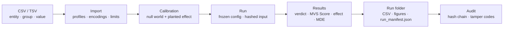
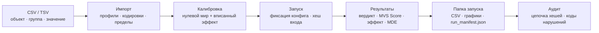

<p align="center">
  
</p>

<h1 align="center" id="mvs-analyzer">MVS Analyzer</h1>

<p align="center">▪</p>

<p align="center"><strong>English</strong> · <a href="#русский">Русский</a></p>

<p align="center">
  Metrics Value System. Which metric actually sees the change you care about?<br>
  Windows desktop · no accounts · no telemetry · no networking code at all
</p>

<p align="center">
  
  
  
  
  
  
  
  
  
</p>

<p align="center">
  <a href="https://github.com/d1d2dopamine/MVS-Analyzer/releases/latest"></a>
</p>

<p align="center">
  <a href="CHANGELOG.md">Changelog</a> ·
  <a href="docs/METHODS.md">Methods</a> ·
  <a href="docs/VALIDATION.md">Validation</a> ·
  <a href="docs/ARCHITECTURE.md">Developer docs</a> ·
  <a href="examples/">Example data</a>
</p>

---

## 🧩 The problem

You measured something — cycle time, optical density, reaction time, yield, error rate — and you have to report *one* number per object. Median? Mean? SD? CV? MAD? IQR?

The usual answer is "whatever the previous paper used". That choice silently decides whether you will see the effect at all, how often you will announce an effect that is not there, and whether the same analysis on a second half of your data would agree with itself.

**MVS Analyzer turns that choice into a measurement.** It replays your own data thousands of times — once in a world where the groups genuinely do not differ, and once in a world where a difference of a known size was planted — and reports, per metric: false-alarm rate, power, robustness to outliers, split-half repeatability, and interval coverage. Then it ranks the metrics and says how much of that ranking the data can actually support.

The intended use is choosing a metric **before** you analyse, or checking that a conclusion does not rest on one lucky metric. Picking the winner *after* looking at the same data you will draw conclusions from costs up to four times the nominal false-alarm rate — see [Validation](docs/VALIDATION.md) for the measured number.

> [!NOTE]
> MVS Analyzer does **not** verify a metric against a gold standard, and it does not know your ground truth. It ranks metrics by how well they behave **on your dataset**, and it is loud about the cases where the data cannot decide.

---

## ✨ Highlights

| | |
|---|---|
| **Ten metrics, one run** | median · mean · SD · CV · MAD · IQR · normalized MAD · normalized IQR · RMS · range |
| **2–10 independent groups** | Mann–Whitney *U* for two groups, Kruskal–Wallis *H* for three to ten |
| **Bootstrap on raw values** | scenarios resample your actual measurements — no invented normal distribution |
| **An honest verdict** | *difference · no difference (TOST) · not enough data · not applicable* |
| **Effect size, not just p** | Cliff's delta with a 95 % percentile bootstrap interval (400 resamples) |
| **MDE** | the smallest effect these data could have detected at power 0.80 |
| **Frozen, hashed formula** | `MVS-1.3.0`, SHA-256 `dcc0ef64…709f9da` — any change is visible in the audit |
| **Tamper-evident runs** | every run folder carries hashes of its inputs *and* outputs, chained in a local journal |
| **Data-only plugins** | templates, import profiles, report templates, validation rules — executables are rejected |
| **Zero dependencies** | pure .NET 8 + WinForms, no NuGet packages, no network, no accounts |

---

## ⚡ Quick start

### Download the build

[Latest release](https://github.com/d1d2dopamine/MVS-Analyzer/releases/latest) → `MVS_Analyzer_<version>_win-x64.zip`. Unzip, run `MVS_Analyzer.exe`. Windows 10 or later, x64; no .NET installation required. The build is not code-signed, so SmartScreen warns on first run — verify the SHA-256 against `SHA256SUMS.txt` in the release, or build from source below.

### Run from source

```powershell
git clone https://github.com/d1d2dopamine/MVS-Analyzer.git
cd MVS-Analyzer

dotnet build MvsAnalyzer.csproj -c Release        # requires .NET 8 SDK, Windows
dotnet run  --project MvsAnalyzer.Tests           # 12 checks, must print 12/12
dotnet run  --project MvsAnalyzer.csproj          # launch the app
```

### Build a standalone EXE

```powershell
.\build_release.bat
# -> bin\Release\net8.0-windows\win-x64\publish\MVS_Analyzer.exe  (self-contained, single file)
```

### First five minutes

1. Pick a language on first launch (English / Русский — changeable later in **Settings**).
2. **Data → Guided example**, or load [`examples/demo_three_groups.csv`](examples/).
3. **Settings** → scenario, outlier rate, missing rate, effect multiplier, seed.
4. **Calibration** → run it. **Run** → start the analysis.
5. **Results** → read the verdict card, then `results.csv` and `run_manifest.json` in the run folder.
6. **Audit** → point it at the output folder and confirm the run verifies.

Want to see the app catch its own mistakes? Load [`examples/MVS_stress_test.csv`](examples/) — *Control* / *Shift +6 %* / *Noise*. Level metrics and spread metrics point at **different** groups there, and the results card is required to say so instead of calling it agreement.

> **Requirements** — Windows 10/11 x64, .NET 8 SDK (build) or nothing at all (self-contained EXE). Visual Studio 2022 with the *.NET desktop development* workload works out of the box: open `MvsAnalyzer.slnx`, or `MvsAnalyzer.csproj` if your IDE does not read `.slnx` yet.

---

## 🔬 How it works



1. **Data.** One variable, 2–10 independent groups, ≥ 4 entities per group, ≥ 6 valid measurements per entity (configurable). Entity-level metrics are computed once.
2. **Calibration.** For every metric, two worlds are simulated from your own rows:
   - a **null world** — groups are pooled and resampled, so no difference can exist by construction. The share of significant results is the measured **false-alarm rate**.
   - an **effect world** — a known multiplier is applied to the last group (level shift, level drop, or extra variability), plus your configured outliers and missing values. The share of significant results is **power**.
3. **Run.** The configuration is frozen, the input file is hashed, and the analysis is executed against the real group labels.
4. **Results.** One sentence first — *which* metric, *which* group is higher, *by how much* — then the statistics behind it, then the files.

<details>
<summary><b>Why calibrating on your own data is not circular</b></summary>

The null world is built by **shuffling group labels**, and the effect world is built by **planting an artificial difference**. Neither ever sees the real answer to "do these groups differ?" — that question is answered once, at the end, by the actual test on the actual labels.

If that is still too close for comfort, switch on **Settings → Scientific rigour → Split calibration**: entities are split in half, the metric is chosen on one half, and the answer is computed on the other. Minimum 8 entities per group. The manifest records which mode was used in `calibration.calibrationSource`.

</details>

---

## 📈 The MVS Score

A single 0–100 number per metric, computed from five measured components:

$$\mathrm{MVS} = 100 \cdot P^{0.30} \cdot F^{0.25} \cdot R^{0.20} \cdot S^{0.15} \cdot C^{0.10}$$

| Symbol | Component | Weight | How it is measured |
|---|---|---|---|
| $P$ | **Power** | 0.30 | share of simulated studies where the planted effect was detected |
| $F$ | **False-alarm control** | 0.25 | $\exp\!\left(-\max(0,\ \mathrm{FPR}-\alpha)/\alpha\right)$ on the pooled null world |
| $R$ | **Robustness** | 0.20 | stability of the metric when contamination is injected into raw values |
| $S$ | **Repeatability** | 0.15 | 50 split-half resamples; agreement of the group median between halves |
| $C$ | **Coverage** | 0.10 | empirical coverage of the 95 % bootstrap interval (200 × 200 resamples) |

The formula string is **frozen and hashed**:

```text
MVS-1.3.0   sha256 = dcc0ef643ff071d8c4c6e5d33a4329f86c49294d156a3463ee6398285709f9da
```

It is written into every `run_manifest.json`, checked by a unit test, and compared during audit. Change the formula and old runs report `FORMULA_CHANGED` — deliberately, loudly.

**Candidate rules.** A metric becomes a *candidate* when `FPR ≤ 0.075`, `power ≥ 0.70` and `score ≥ 60`, capped at four candidates. A metric that passes every rule but loses the cap (or trails the last candidate by < 2 points) is reported as a **near miss** rather than quietly dropped. **The candidate set is allowed to be empty** — that is a result, not a bug.

**What the score is not.** It has no units — every component is dimensionless, the exponents sum to 1, so the result is a weighted geometric mean bounded in [0, 100]. It is an **ordinal** scale: a metric ranking above another means something, a gap of eight points does not. The `score ≥ 60` gate is a distance claim on that ordinal scale and is on notice for removal in 1.4.0. Full argument: [docs/METHODS.md](docs/METHODS.md#dimensional-analysis-and-what-the-scale-is).

**The weights are judgement calls,** and rather than defend them the project measures them: `validation/analyze_results.py` recomputes any finished run under equal, rank-order-centroid, power-only and 5 000 Dirichlet weight vectors and reports how often the winner changes.

---

## ⚗️ Verdicts: a run says what it *cannot* say

| Verdict | Meaning | Rule |
|---|---|---|
| **Difference** | the groups differ | `p < α` and the effect interval excludes zero |
| **No difference** | the groups are equivalent | the whole interval lies inside the equivalence margin (TOST) |
| **Not enough data** | honest "don't know" | the interval covers both a real difference and no difference |
| **Not applicable** | the metric cannot be computed here | e.g. CV on values centred at zero |

Effect size is **Cliff's delta** between the two most separated groups, with a 95 % percentile bootstrap interval over entities (400 resamples). The equivalence margin defaults to `0.147` ("negligible") and is configurable.

**MDE** — the minimum detectable effect at power 0.80 — is interpolated from the effect grid `1.00 / 1.02 / 1.05 / 1.10 / 1.20`. If the measured false-alarm rate is inflated above `max(1.5α, α + 0.02)`, the MDE is replaced by a warning: the verdict cannot be trusted on that metric.

---

## 📦 Run outputs

Every run writes a self-contained, hash-verified folder:

| File | Contents |
|---|---|
| `results.csv` | per metric: group summary, global *p*, Cliff's delta + CI, equivalence *p*, verdict, MDE, FPR (+ inflation flag), power, robustness, repeatability, coverage, MVS Score, applicable, candidate, near-miss |
| `calibration.csv` | per metric: FPR, power, full power curve, MDE, robustness, repeatability, coverage, score |
| `data_quality.csv` | per entity: group, valid measurements and all ten metrics (identifiers pseudonymized by default) |
| `run_manifest.json` | full provenance: app + engine version, formula string & hash, seed, scenario, α, effect grid, equivalence margin, calibration source, plugin set, figure settings, SHA-256 of the **input** file and of every output file |
| `*.png` / `*.svg` | figures: value distribution, MVS ranking, FPR × power map, group comparison, data quality, plus any plugin templates |
| `report_*.txt` | text reports contributed by plugins (written before the manifest, therefore hashed too) |

Numbers are formatted round-trip (`R`) and culture-invariant, so `0.0477` stays `0.0477` in every locale and Excel never eats a decimal comma.

---

## 🔐 Reproducibility and audit

- Each run folder is hashed **including the input dataset** — a result can be tied back to the data it claims to describe.
- Every run is appended to `%LocalAppData%\MVS_Analyzer\run_journal.jsonl`, where each line stores the SHA-256 of the previous line. Deleting or rewriting an inconvenient run breaks the chain.
- **Audit** (sidebar, `Ctrl+9`) walks a folder recursively, recomputes every hash and reports:

| Code | What it caught |
|---|---|
| `FILE_MODIFIED` / `FILE_MISSING` | a result was edited or deleted after the run |
| `FORMULA_CHANGED` | the MVS formula differs from the frozen specification |
| `NO_INPUT_HASH` | legacy run without an input hash |
| `ENGINE_DIFFERS` | another engine version produced the numbers |
| `ORPHAN_RESULTS` | `results.csv` without a manifest — nothing to verify against |
| `SETTINGS_VARIED` | seed / effect / scenario changed on the same dataset |
| `CANDIDATE_SET_UNSTABLE` | the same data produced different candidate sets |
| `RUN_HIDDEN` | the journal remembers a run that is no longer in the folder |
| `JOURNAL_BROKEN` | the hash chain does not verify |

> [!IMPORTANT]
> Hashes prove **integrity, not honesty**. They catch edits, deletions and hidden runs. They cannot catch somebody who starts over in a clean copy on another machine — and the app says so in its own documentation rather than pretending otherwise.

---

## 🧪 Benchmark

**Settings → scroll to the bottom → "Developer — benchmark"**, or headless:

```powershell
MVS_Analyzer.exe --benchmark --profile full --seed 20260904 --out C:\bench
```

The benchmark answers one question with the pass marks written down first: **does choosing a metric after seeing the data inflate the error rate, and does the gated MVS path remove that inflation without costing all the power?** Seven selection rules — cherry-picking, Bonferroni, two fixed metrics, a locked pilot metric, and the MVS path with and without its gate — see exactly the same data in every repetition, alongside an oracle that picks the best metric with hindsight.

The protocol (`MVS-BENCH-1.0.0`, SHA-256 `5557f86f…c36294`) is frozen in source, checked by the test suite, and printed on every figure, so a threshold cannot be moved after seeing a result without the change being visible on images that were already published.

| # | Pre-registered claim | Pass |
|---|---|---|
| A | Metric shopping inflates error; the gate removes it | cherry-pick FPR ≥ .15 **and** MVS FPR ≤ .075 |
| B | The gate is not expensive | oracle power − MVS power ≤ .07 |
| C | The choice is stable, not a coin flip | Kendall τ ≥ .70, top-1 agreement ≥ .60 |
| D | Contamination does not break it | MVS FPR ≤ .075 at 10 % contamination |
| E | The run is reproducible | identical SHA-256 on a repeat with the same seed |

A run writes 14 publication-ready PNG figures (print, story, square and wide sizes, Okabe-Ito palette), five CSV tables, the verbatim protocol, a manifest and `SHA256SUMS.txt`, then opens the folder. The verdict — **go**, **conditional** or **no-go** — is printed whichever way it lands, and each run is appended to a hash-chained journal so a disappointing result cannot be quietly deleted.

Full protocol, figure guide and the honest list of what it does *not* prove: **[`docs/BENCHMARK.md`](docs/BENCHMARK.md)**. Optional real-recording stage: [`benchmark_data/README.md`](benchmark_data/README.md).

---

## 🛡️ Privacy by construction

No accounts, no telemetry, no network calls, no cloud — none of it is implemented and none of it is planned. Everything lives in `%LocalAppData%\MVS_Analyzer\`:

```text
settings.txt        language.txt        window.txt
run_journal.jsonl   plugins\<plugin-id>\
```

Entity identifiers are pseudonymized in exports by default (`P_<sha256[..10]>`). Sharing a result means sharing a run folder; anybody can verify it offline with **Audit**.

---

## 📄 Data format

CSV or TSV, one variable per run, delimiter auto-detected (`,` `;` tab), BOM-aware UTF‑8 / UTF‑16, with a Windows‑1251 fallback for legacy Cyrillic exports.

| Role | Required | Recognized column names |
|---|---|---|
| `entity` | ✅ | entity, entity_id, device, device_id, machine, asset, item, sample, object, participant, subject, id |
| `value` | ✅ | value, measurement, reading, result, signal, rt, rt_ms, reaction_time, response_time |
| `group` | ✅ | group, condition, class, category, variant, model, arm |
| `sequence` | — | sequence, index, trial, trial_number, measurement_number, timepoint, step |
| `variable` | — | variable, metric, parameter, measurement_name, signal_name |
| `unit` | — | unit, units |

```csv
entity,group,value,sequence,variable,unit
G1_01,Group 1,117.828,1,demo_measurement,unit
G1_01,Group 1,102.150,2,demo_measurement,unit
```

Any other naming (or a semicolon + decimal-comma export from a lab device) is handled by an **import profile** from a plugin — see [`examples/lab_device_ru_win1251.csv`](examples/) and [docs/DATA_FORMAT.md](docs/DATA_FORMAT.md).

---

## 🧱 Plugins (data only)

A `.mvsplugin` file is a ZIP with `plugin.json` at its root, installed into `%LocalAppData%\MVS_Analyzer\plugins`.

```json
{
  "id": "mvs.report.pack",
  "name": "MVS Report Pack",
  "version": "1.0.0",
  "author": "d1d2dopamine",
  "type": "visualization",
  "minAppVersion": "1.1.0",
  "description": "Four declarative report templates. No code."
}
```

A plugin may add figure templates, import profiles, settings profiles, report templates, validation rules and terminology. It may **not** add code: `.dll .exe .bat .cmd .ps1 .vbs .js .hta .com .scr` are rejected at install time, together with path traversal, packages over 2000 files or 64 MB, and `minAppVersion` above the running engine. Every enabled plugin, its SHA-256 and any rejected file are recorded in the run manifest.

Three ready-made packs live in this repository: [`plugin-report-pack-source`](plugin-report-pack-source), [`plugin-lab-pack-source`](plugin-lab-pack-source), [`plugin-stress-pack-source`](plugin-stress-pack-source). Full format reference: [docs/PLUGINS.md](docs/PLUGINS.md).

---

## ⌨️ Keyboard

| | | | |
|---|---|---|---|
| `Ctrl`+`1` Home | `Ctrl`+`2` Project | `Ctrl`+`3` Data | `Ctrl`+`4` Calibration |
| `Ctrl`+`5` Run | `Ctrl`+`6` Results | `Ctrl`+`7` Figures | `Ctrl`+`8` Outputs |
| `Ctrl`+`9` Audit | `Ctrl`+`0` Settings | | |

Window size and state are remembered between launches. Settings apply immediately — there are no *Apply* buttons and no "saved!" pop-ups anywhere in the app.

---

## 🗂️ Repository layout

```text
MVS-Analyzer/
├─ MvsAnalyzer.slnx              solution (also open MvsAnalyzer.csproj directly)
├─ MvsAnalyzer.csproj            WinForms app, net8.0-windows, no NuGet packages
├─ Program.cs                    entry point, language dialog, global exception guard
├─ MainForm.cs                   shell: theme, navigation, cards, grids, hotkeys
├─ MainForm.Pages.cs             the 13 sections of the UI
├─ AnalysisEngine.cs             metrics, tests, calibration, effect size, verdicts, MDE
├─ OutputExporter.cs             frozen formula string, CSV writers, run manifest
├─ RunAuditor.cs                 run journal (hash chain) and folder audit
├─ CsvImporter.cs                delimiters, encodings, roles, import profiles
├─ FigureGenerator.cs            figure rendering (System.Drawing)
├─ PluginManager.cs              install / verify / enable plugin packages
├─ PluginAssets.cs               profiles, report templates, validation rules, terms
├─ Assets/                       in-app branding embedded into the executable
├─ MvsAnalyzer.Tests/            dependency-free test harness (12 checks)
├─ examples/                     ready-to-load datasets
├─ validation/                   ground-truth datasets, reference simulation, weight analysis
├─ docs/                         methods, data format, outputs, audit, plugins, architecture
└─ plugin-*-source/              source of the bundled plugin packs
```

---

## 🚧 Status, limitations, roadmap

**Known limitations — stated on purpose:**

- independent groups only; paired and repeated-measures designs are not implemented yet;
- Kruskal–Wallis has no post-hoc pairwise tests yet — the global *p* answers "any difference", not "which pair";
- the generic outlier model is not a physical model of your instrument;
- layout inside cards still uses absolute coordinates, so 125–150 % scaling can shift elements;
- run history is kept for the session only (the audit journal is permanent);
- for clinical, industrial or safety-critical decisions this tool is an input, not an authority — get independent validation.

**Open methodological questions — the honest list.** After a public review of the method in August 2026, the following are unresolved and are being measured rather than argued:

- **Selecting a metric on the same data you report inflates the error rate.** Under a pure null, the chance that at least one of the ten metrics comes out significant is **0.205**, not 0.05. Use split calibration, or fix the metric before looking. See [docs/METHODS.md](docs/METHODS.md#three-modes-and-only-one-of-them-is-safe).
- **A summary statistic should be chosen a priori** from the structure you expect the data to have. This tool is at its most defensible *before* the analysis (choosing a design) or *after* a pre-specified one (showing robustness), and at its least defensible in between.
- **The weights are judgement, not evidence** — quantified by the sensitivity analysis in [`validation/`](validation/README.md).
- **The score measures detection, not estimation.** Bias, MSE and relative efficiency are not in it yet, so it cannot distinguish statistics that estimate different quantities equally well.
- **The geometric mean is missing**, and in the reference table it is the best statistic on multiplicative data — better than all ten shipped metrics.

The experiments, thresholds and current results are in [docs/VALIDATION.md](docs/VALIDATION.md), frozen in advance in [docs/PREREGISTRATION.md](docs/PREREGISTRATION.md). Independent replication is welcome: datasets, seeds and an independent reference implementation are in the repository for exactly that.

**Roadmap:** paired / repeated designs · post-hoc pairwise comparisons · `TableLayoutPanel` relayout and DPI hardening · persistent run history · accessibility (mnemonics, screen readers) · more localizations.

See [CHANGELOG.md](CHANGELOG.md) for the full history — including the two bugs that version 1.3.2 exists to fix.

---

## ❓ FAQ

<details>
<summary><b>Does it need internet, an account, or a licence key?</b></summary>

No. There is no networking code in the project. Results travel as folders you can verify offline.

</details>

<details>
<summary><b>Can the candidate set really be empty?</b></summary>

Yes, and it should be, when no metric reaches `FPR ≤ 0.075`, `power ≥ 0.70` and `score ≥ 60`. The results card then states plainly that it is showing the highest-scoring metric, *not* a recommendation.

</details>

<details>
<summary><b>Why do old runs stop matching after an update?</b></summary>

Because the formula version changed. That is what `FORMULA_CHANGED` is for: the audit tells you the numbers came from a different definition, so those runs have to be repeated. Version numbers are only meaningful if they are enforced.

</details>

<details>
<summary><b>Ten metrics on one dataset — where is the multiplicity correction?</b></summary>

Metric selection is treated as a *calibration* problem, not as ten independent hypothesis tests: the ranking is judged by measured false-alarm rate rather than by the *p*-values themselves, and inflated FPR is flagged per metric. If you need a strictly pre-registered answer, use split calibration and report the metric chosen on the first half.

</details>

<details>
<summary><b>Linux or macOS?</b></summary>

The engine is portable .NET, but the UI is WinForms + `System.Drawing`, so the app is Windows-only today. A headless CLI over the same engine is the natural next step.

</details>

---

## 🤝 Contributing

Bug reports and pull requests are welcome — start with [CONTRIBUTING.md](CONTRIBUTING.md), and read [docs/METHODS.md](docs/METHODS.md) first if the change touches statistics. One rule above all others: **if the score definition changes, the formula version, its hash and `FormulaHash` test must change with it, in the same commit.**

- Bugs and ideas → [Issues](https://github.com/d1d2dopamine/MVS-Analyzer/issues)
- Security and plugin-safety reports → [SECURITY.md](SECURITY.md)
- Behaviour in the community → [CODE_OF_CONDUCT.md](CODE_OF_CONDUCT.md)

---

## 📌 Citation

If MVS Analyzer influenced a published result, cite it with the metadata in [CITATION.cff](CITATION.cff) and include the `formula.hash` and `engineVersion` from your `run_manifest.json` — that pair identifies exactly how the numbers were produced.

---

## ⚖️ License

[MIT](LICENSE) © d1d2dopamine

---

<p align="center">
  
</p>

<h1 align="center" id="русский">MVS Analyzer</h1>

<p align="center">▪</p>

<p align="center"><a href="#mvs-analyzer">English</a> · <strong>Русский</strong></p>

<p align="center">
  Metrics Value System. Какая метрика действительно видит изменение, которое вам важно?<br>
  Настольное приложение для Windows · без аккаунтов · без телеметрии · вообще без сетевого кода
</p>

<p align="center">
  
  
  
  
  
  
  
  
  
</p>

<p align="center">
  <a href="https://github.com/d1d2dopamine/MVS-Analyzer/releases/latest"></a>
</p>

<p align="center">
  <a href="CHANGELOG.md">Изменения</a> ·
  <a href="docs/METHODS.md">Методы</a> ·
  <a href="docs/VALIDATION.md">Валидация</a> ·
  <a href="docs/ARCHITECTURE.md">Документация</a> ·
  <a href="examples/">Примеры данных</a>
</p>

---

## 🧩 Зачем это нужно

Вы что-то измерили — время цикла, оптическую плотность, время реакции, выход годного, долю ошибок — и должны отчитаться *одним* числом на объект. Медиана? Среднее? SD? CV? MAD? IQR?

Обычно ответ звучит как «так делали в прошлой статье». Но именно этот выбор решает, увидите ли вы эффект вообще, как часто вы объявите эффект, которого нет, и совпадёт ли анализ сам с собой на второй половине данных.

**MVS Analyzer превращает этот выбор в измерение.** Он тысячи раз переигрывает ваши же данные — в мире, где разницы между группами точно нет, и в мире, где разница известного размера вписана искусственно, — и для каждой метрики измеряет: частоту ложных тревог, мощность, устойчивость, повторяемость и покрытие интервалов. Затем он ранжирует метрики и говорит, насколько этот порядок вообще подкреплён данными.

Программа рассчитана на то, что метрику выбирают **до** анализа — либо на проверку того, что вывод не держится на одной удачной метрике. Если выбирать победителя по тем же данным, по которым потом делается вывод, цена ошибки вырастает до четырёх раз против номинальной — измеренное число см. в [Валидации](docs/VALIDATION.md).

> [!NOTE]
> Программа **не** сверяет метрику с эталоном и не знает истины. Она ранжирует метрики по тому, как они ведут себя **на вашем датасете**, и громко сообщает, когда данных не хватает для вывода.

---

## ✨ Коротко о главном

| | |
|---|---|
| **10 метрик за один запуск** | median · mean · SD · CV · MAD · IQR · normalized MAD · normalized IQR · RMS · range |
| **2–10 независимых групп** | Mann–Whitney для двух, Kruskal–Wallis для трёх и более |
| **Bootstrap по сырым значениям** | сценарии перевыбирают ваши измерения, а не придуманное нормальное распределение |
| **Честный вердикт** | *есть разница · разницы нет (TOST) · данных не хватает · неприменима* |
| **Размер эффекта, а не только p** | дельта Клиффа с 95 %-м бутстрэп-интервалом (400 повторов) |
| **MDE** | минимальная разница, которую эти данные вообще способны заметить при мощности 0.80 |
| **Замороженная формула** | `MVS-1.3.0`, SHA-256 `dcc0ef64…709f9da` — любое изменение видно в аудите |
| **Прогоны с печатью** | хешируются входные *и* выходные файлы, журнал — цепочка хешей |
| **Плагины без кода** | шаблоны, профили импорта, отчёты, правила проверки — исполняемые файлы запрещены |
| **Ноль зависимостей** | чистый .NET 8 + WinForms, без NuGet, без сети, без аккаунтов |

---

## ⚡ Быстрый старт

### Скачать сборку

[Последний релиз](https://github.com/d1d2dopamine/MVS-Analyzer/releases/latest) → `MVS_Analyzer_<версия>_win-x64.zip`. Распакуйте и запустите `MVS_Analyzer.exe`. Нужна Windows 10+ x64, устанавливать .NET не требуется. Сборка не подписана, поэтому при первом запуске SmartScreen покажет предупреждение — сверьте SHA-256 архива с `SHA256SUMS.txt` из релиза или соберите сами.

### Сборка из исходников

```powershell
git clone https://github.com/d1d2dopamine/MVS-Analyzer.git
cd MVS-Analyzer

dotnet build MvsAnalyzer.csproj -c Release     # нужен .NET 8 SDK и Windows
dotnet run  --project MvsAnalyzer.Tests        # 12 проверок, должно быть 12/12
dotnet run  --project MvsAnalyzer.csproj       # запуск приложения
```

Автономный EXE для Windows x64:

```powershell
.\build_release.bat
# -> bin\Release\net8.0-windows\win-x64\publish\MVS_Analyzer.exe
```

В Visual Studio 2022 с workload «.NET desktop development» откройте `MvsAnalyzer.slnx` (если `.slnx` не распознаётся — `MvsAnalyzer.csproj`) и выполните Build Solution.

### Первые пять минут

1. На первом запуске выберите язык (меняется потом в «Настройках»).
2. «Данные» → «Пример», либо загрузите [`examples/demo_three_groups.csv`](examples/).
3. «Настройки» → сценарий, выбросы, пропуски, множитель эффекта, seed.
4. «Калибровка» → «Запуск».
5. «Результаты» → карточка вердикта, затем `results.csv` и `run_manifest.json`.
6. «Аудит» → укажите папку вывода и убедитесь, что прогон проверяется.

Хотите увидеть, как программа ловит сама себя? Загрузите [`examples/MVS_stress_test.csv`](examples/) — *Control / Shift +6 % / Noise*. Метрики уровня и метрики разброса там указывают на **разные** группы, и карточка результатов обязана это сказать, а не называть согласием.

---

## 🔬 Как это работает



1. **Данные.** Одна переменная, 2–10 независимых групп, ≥ 4 объектов в группе, ≥ 6 годных измерений на объект (настраивается).
2. **Калибровка.** Для каждой метрики строятся два мира из ваших же строк:
   - **нулевой** — группы объединяются и перевыбираются, разницы там нет по построению. Доля значимых результатов — измеренная **частота ложных тревог**;
   - **мир с эффектом** — к последней группе применяется известный множитель (сдвиг уровня вверх/вниз или рост вариативности) плюс ваши выбросы и пропуски. Доля значимых результатов — **мощность**.
3. **Запуск.** Конфигурация фиксируется, входной файл хешируется, расчёт идёт по настоящим меткам групп.
4. **Результаты.** Сначала одно предложение — какая метрика, какая группа выше и на сколько процентов, — потом статистика, потом файлы.

<details>
<summary><b>Почему калибровка на своих же данных — не подгонка</b></summary>

Нулевой мир строится **перемешиванием меток групп**, эффект **вписывается искусственно**. Калибровка никогда не видит настоящий ответ на вопрос «есть ли разница между группами» — он считается один раз, в конце, на реальных метках.

Если этого мало — включите «Настройки → Научная строгость → Раздельная калибровка»: объекты делятся пополам, метрика выбирается на одной половине, ответ считается на другой. Минимум 8 объектов в группе. Режим записывается в манифест (`calibration.calibrationSource`).

</details>

---

## 📈 MVS Score

Одно число 0–100 на метрику из пяти измеренных компонентов:

$$\mathrm{MVS} = 100 \cdot P^{0.30} \cdot F^{0.25} \cdot R^{0.20} \cdot S^{0.15} \cdot C^{0.10}$$

| Символ | Компонент | Вес | Как измеряется |
|---|---|---|---|
| $P$ | **Мощность** | 0.30 | доля симуляций, где вписанный эффект был обнаружен |
| $F$ | **Контроль ложных тревог** | 0.25 | $\exp\!\left(-\max(0,\ \mathrm{FPR}-\alpha)/\alpha\right)$ на объединённых группах |
| $R$ | **Устойчивость** | 0.20 | стабильность метрики при загрязнении сырых значений |
| $S$ | **Повторяемость** | 0.15 | 50 разбиений пополам; согласие групповой медианы между половинами |
| $C$ | **Покрытие** | 0.10 | эмпирическое покрытие 95 %-го бутстрэп-интервала (200 × 200) |

Строка формулы **заморожена и захеширована**:

```text
MVS-1.3.0   sha256 = dcc0ef643ff071d8c4c6e5d33a4329f86c49294d156a3463ee6398285709f9da
```

Она попадает в каждый `run_manifest.json`, проверяется тестом и сверяется при аудите. Измените формулу — старые прогоны честно покажут `FORMULA_CHANGED`.

**Правила кандидата:** `FPR ≤ 0.075`, `мощность ≥ 0.70`, `score ≥ 60`, не более четырёх кандидатов. Метрика, которая прошла все правила, но не попала в лимит (или отстала меньше чем на 2 балла), помечается как **«почти кандидат»**. **Набор кандидатов может быть пустым** — это результат, а не ошибка.

**Чем этот балл не является.** У него нет единиц измерения: все компоненты безразмерны, показатели степени в сумме дают 1, то есть это взвешенное среднее геометрическое в диапазоне [0, 100]. Шкала **порядковая**: «метрика A выше метрики B» — осмысленно, «на 8 баллов лучше» — нет. Порог `score ≥ 60` — это утверждение о расстоянии на порядковой шкале, и он снимается в 1.4.0. Подробно: [docs/METHODS.md](docs/METHODS.md#dimensional-analysis-and-what-the-scale-is).

**Веса — экспертное решение,** и вместо защиты этого решения проект его измеряет: `validation/analyze_results.py` пересчитывает любой готовый запуск с равными весами, ROC-весами, весами «только мощность» и 5 000 случайных векторов Дирихле и показывает, как часто меняется победитель.

---

## ⚗️ Вердикты

| Вердикт | Смысл | Правило |
|---|---|---|
| **Есть разница** | группы различаются | `p < α` и интервал эффекта не накрывает ноль |
| **Разницы нет** | эквивалентность | весь интервал внутри границы эквивалентности (TOST) |
| **Данных не хватает** | честное «не знаю» | интервал охватывает и разницу, и её отсутствие |
| **Неприменима** | метрику нельзя посчитать | например CV при среднем около нуля |

Размер эффекта — дельта Клиффа между двумя наиболее разделёнными группами с 95 %-м перцентильным бутстрэп-интервалом (400 перевыборок). Граница эквивалентности по умолчанию `0.147`.

**MDE** интерполируется по сетке эффектов `1.00 / 1.02 / 1.05 / 1.10 / 1.20` при мощности 0.80. Если измеренный FPR выше `max(1.5α, α + 0.02)`, вместо MDE показывается предупреждение: вердикту по этой метрике доверять нельзя.

---

## 📦 Файлы запуска

| Файл | Содержимое |
|---|---|
| `results.csv` | по метрикам: сводка по группам, глобальный *p*, дельта Клиффа с ДИ, *p* эквивалентности, вердикт, MDE, FPR (и флаг завышения), мощность, устойчивость, повторяемость, покрытие, MVS Score, применимость, кандидат, почти-кандидат |
| `calibration.csv` | FPR, мощность, кривая мощности, MDE, устойчивость, повторяемость, покрытие, score |
| `data_quality.csv` | по объектам: группа, число измерений и все десять метрик (идентификаторы псевдонимизированы) |
| `run_manifest.json` | полная провенанс-запись: версии, формула и её хеш, seed, сценарий, α, сетка эффектов, граница эквивалентности, источник калибровки, плагины, настройки графиков, SHA-256 входного файла и каждого выходного |
| `*.png` / `*.svg` | графики: распределение значений, ранжирование MVS, карта FPR × мощность, сравнение групп, качество данных и шаблоны плагинов |
| `report_*.txt` | текстовые отчёты плагинов (пишутся до манифеста, поэтому тоже хешируются) |

Числа записываются в формате `R` и без культурных разделителей: `0.0477` остаётся `0.0477` в любой локали, и Excel больше не съедает запятую.

---

## 🔐 Воспроизводимость и аудит

- Папка запуска хешируется **вместе с входным датасетом** — результат привязан к данным, которые он описывает.
- Каждый прогон дописывается в `%LocalAppData%\MVS_Analyzer\run_journal.jsonl`, где каждая строка хранит SHA-256 предыдущей. Удалить неудобный прогон незаметно не получится.
- Раздел **«Аудит»** (`Ctrl+9`) рекурсивно проверяет папку и выдаёт коды: `FILE_MODIFIED`, `FILE_MISSING`, `FORMULA_CHANGED`, `NO_INPUT_HASH`, `ENGINE_DIFFERS`, `ORPHAN_RESULTS`, `SETTINGS_VARIED`, `CANDIDATE_SET_UNSTABLE`, `RUN_HIDDEN`, `JOURNAL_BROKEN`.

> [!IMPORTANT]
> Хеши доказывают **целостность, а не честность**. Они ловят правку и удаление задним числом и спрятанные прогоны. Если человек с самого начала делает всё в чистой копии на другом компьютере — никакая программа этого не увидит.

---

## 🧪 Бенчмарк

**Настройки → в самый низ → «Для разработчика — бенчмарк»**, либо без окна:

```powershell
MVS_Analyzer.exe --benchmark --profile full --seed 20260904 --out C:\bench
```

Бенчмарк отвечает на один вопрос, причём пороги записаны заранее: **завышает ли ошибку выбор метрики уже после взгляда на данные и убирает ли это завышение путь MVS с порогом — не теряя при этом всю мощность?** Семь правил выбора — перебор, Bonferroni, две фиксированные метрики, метрика, зафиксированная на пилоте, и путь MVS с порогом и без — видят в каждом повторении одни и те же данные; рядом считается оракул, выбирающий лучшую метрику задним числом.

Протокол (`MVS-BENCH-1.0.0`, SHA-256 `5557f86f…c36294`) заморожен в исходниках, проверяется тестами и печатается на каждом графике: подвинуть порог после результата, не оставив следа на уже опубликованных картинках, нельзя.

| # | Заранее записанное утверждение | Порог |
|---|---|---|
| A | Перебор метрик завышает ошибку, порог MVS её убирает | FPR перебора ≥ .15 **и** FPR MVS ≤ .075 |
| B | Порог стоит недорого | мощность оракула − мощность MVS ≤ .07 |
| C | Выбор устойчив, а не подброс монеты | τ Кендалла ≥ .70, совпадение топ-1 ≥ .60 |
| D | Загрязнение данных его не ломает | FPR MVS ≤ .075 при 10 % загрязнения |
| E | Прогон воспроизводим | тот же SHA-256 при повторе с тем же seed |

Прогон сохраняет 14 готовых к публикации PNG (печать, сторис, квадрат, широкий; палитра Okabe-Ito), пять CSV-таблиц, дословный текст протокола, манифест и `SHA256SUMS.txt`, после чего открывает папку. Вердикт — **go**, **conditional** или **no-go** — печатается в любом случае, а каждый прогон дописывается в журнал с цепочкой хешей, так что неудобный результат нельзя молча удалить.

Полный протокол, разбор графиков и честный список того, что бенчмарк **не** доказывает: **[`docs/BENCHMARK.md`](docs/BENCHMARK.md)**. Необязательная стадия на реальных записях: [`benchmark_data/README.md`](benchmark_data/README.md).

---

## 🛡️ Приватность по построению

Нет аккаунтов, телеметрии, сетевых вызовов и облака — ничего из этого не реализовано и не планируется. Всё лежит в `%LocalAppData%\MVS_Analyzer\`: `settings.txt`, `language.txt`, `window.txt`, `run_journal.jsonl`, `plugins\`.

---

## 📄 Формат данных

CSV или TSV, одна переменная за запуск, разделитель определяется автоматически (`,` `;` табуляция), поддержаны BOM UTF‑8 / UTF‑16 и откат на Windows‑1251.

| Роль | Обязательна | Распознаваемые имена колонок |
|---|---|---|
| `entity` | ✅ | entity, entity_id, device, machine, asset, item, sample, object, participant, subject, id |
| `value` | ✅ | value, measurement, reading, result, signal, rt, rt_ms, reaction_time, response_time |
| `group` | ✅ | group, condition, class, category, variant, model, arm |
| `sequence` | — | sequence, index, trial, trial_number, measurement_number, timepoint, step |
| `variable` | — | variable, metric, parameter, measurement_name, signal_name |
| `unit` | — | unit, units |

Любые другие имена (или экспорт лабораторного прибора с `;` и десятичной запятой) решаются **профилем импорта** из плагина — см. [`examples/lab_device_ru_win1251.csv`](examples/) и [docs/DATA_FORMAT.md](docs/DATA_FORMAT.md).

---

## 🧱 Плагины (только данные)

Файл `.mvsplugin` — это ZIP с `plugin.json` в корне, устанавливается в `%LocalAppData%\MVS_Analyzer\plugins`. Плагин может добавлять шаблоны графиков, профили импорта и настроек, шаблоны отчётов, правила проверки и словари терминов. Код запрещён: `.dll .exe .bat .cmd .ps1 .vbs .js .hta .com .scr` отклоняются при установке, как и выход за пределы папки, пакеты больше 2000 файлов или 64 МБ и слишком высокий `minAppVersion`.

В репозитории есть три готовых пакета: [`plugin-report-pack-source`](plugin-report-pack-source), [`plugin-lab-pack-source`](plugin-lab-pack-source), [`plugin-stress-pack-source`](plugin-stress-pack-source). Справочник: [docs/PLUGINS.md](docs/PLUGINS.md).

---

## ⌨️ Горячие клавиши

| | | | |
|---|---|---|---|
| `Ctrl`+`1` Главная | `Ctrl`+`2` Проект | `Ctrl`+`3` Данные | `Ctrl`+`4` Калибровка |
| `Ctrl`+`5` Запуск | `Ctrl`+`6` Результаты | `Ctrl`+`7` Графики | `Ctrl`+`8` Файлы |
| `Ctrl`+`9` Аудит | `Ctrl`+`0` Настройки | | |

Размер окна запоминается между запусками. Настройки применяются сразу — кнопок «Применить» и окон «Сохранено» в программе нет.

---

## 🗂️ Структура репозитория

```text
MVS-Analyzer/
├─ MvsAnalyzer.slnx              решение (можно открыть и просто MvsAnalyzer.csproj)
├─ MvsAnalyzer.csproj            WinForms-приложение, net8.0-windows, без NuGet
├─ Program.cs                    точка входа, выбор языка, глобальный перехват ошибок
├─ MainForm.cs                   оболочка: тема, навигация, карточки, таблицы, хоткеи
├─ MainForm.Pages.cs             13 разделов интерфейса
├─ AnalysisEngine.cs             метрики, тесты, калибровка, размер эффекта, вердикты, MDE
├─ OutputExporter.cs             замороженная строка формулы, запись CSV, манифест запуска
├─ RunAuditor.cs                 журнал запусков (цепочка хешей) и аудит папки
├─ CsvImporter.cs                разделители, кодировки, роли колонок, профили импорта
├─ FigureGenerator.cs            отрисовка графиков (System.Drawing)
├─ PluginManager.cs              установка / проверка / включение плагинов
├─ PluginAssets.cs               профили, шаблоны отчётов, правила проверки, термины
├─ Assets/                       брендинг, встраиваемый в исполняемый файл
├─ MvsAnalyzer.Tests/            собственный тест-раннер без зависимостей (12 проверок)
├─ examples/                     готовые датасеты для загрузки
├─ validation/                   датасеты с известной истиной, эталонная симуляция, анализ весов
├─ docs/                         методы, формат данных, вывод, аудит, плагины, архитектура
└─ plugin-*-source/              исходники встроенных плагин-пакетов
```

---

## 🚧 Ограничения и планы

- только независимые группы; парные и повторные дизайны запланированы;
- у Kruskal–Wallis пока нет post-hoc попарных тестов;
- универсальная модель выбросов не заменяет физическую модель прибора;
- внутри карточек остались абсолютные координаты — на масштабе 125–150 % вёрстка может поехать;
- история запусков живёт только в текущей сессии (журнал аудита — постоянен);
- для клинических, промышленных и безопасностно-критичных решений нужна независимая валидация.

**Открытые методологические вопросы — честный список.** После публичного разбора метода в августе 2026 нерешённым остаётся следующее, и это измеряется, а не обсуждается:

- **Выбор метрики на тех же данных, по которым потом делается вывод, завышает ошибку I рода.** При полном отсутствии эффекта вероятность того, что хотя бы одна из десяти метрик окажется значимой, равна **0.205**, а не 0.05. Помогает раздельная калибровка или выбор метрики до просмотра данных. См. [docs/METHODS.md](docs/METHODS.md#three-modes-and-only-one-of-them-is-safe).
- **Сводную статистику следует выбирать априорно** — из той структуры, которую вы ожидаете от данных. Инструмент наиболее уместен *до* анализа (планирование) или *после* заранее заданного анализа (проверка устойчивости вывода), и наименее уместен между этими двумя моментами.
- **Веса — экспертное решение, а не измерение**; их влияние оценивается анализом чувствительности в [`validation/`](validation/README.md).
- **Балл измеряет обнаружение, а не оценивание.** Смещения, MSE и относительной эффективности в нём пока нет, поэтому он не различает статистики, оценивающие разные величины.
- **Среднего геометрического нет в списке метрик**, а в эталонной таблице именно оно лучше всех десяти реализованных на мультипликативных данных.

Эксперименты, пороги и текущие результаты — в [docs/VALIDATION.md](docs/VALIDATION.md), зафиксированы заранее в [docs/PREREGISTRATION.md](docs/PREREGISTRATION.md). Независимая перепроверка приветствуется: датасеты, зерна генератора и независимая эталонная реализация лежат в репозитории именно для этого.

Планы: парные/повторные дизайны · post-hoc сравнения · переход на `TableLayoutPanel` и DPI · постоянная история запусков · доступность · новые локализации.

Полная история изменений — [CHANGELOG.md](CHANGELOG.md).

---

## ❓ Вопросы и ответы

<details>
<summary><b>Нужен ли интернет, аккаунт или ключ?</b></summary>

Нет. Сетевого кода в проекте нет вообще. Результаты передаются папками, которые проверяются оффлайн.

</details>

<details>
<summary><b>Набор кандидатов действительно может быть пустым?</b></summary>

Да — и так и должно быть, если ни одна метрика не дотягивает до `FPR ≤ 0.075`, `мощность ≥ 0.70` и `score ≥ 60`. Карточка результатов тогда прямо говорит, что показывает метрику с наивысшим баллом, а *не* рекомендацию.

</details>

<details>
<summary><b>Почему после обновления старые прогоны перестают сходиться?</b></summary>

Потому что изменилась версия формулы. Именно для этого есть `FORMULA_CHANGED`: аудит сообщает, что числа получены по другому определению, и такие прогоны надо повторить. Номера версий имеют смысл только тогда, когда их кто-то проверяет.

</details>

<details>
<summary><b>Десять метрик на одних данных — где поправка на множественность?</b></summary>

Выбор метрики здесь — задача *калибровки*, а не десять независимых проверок гипотез: ранжирование судится по измеренной частоте ложных тревог, а не по самим *p*, и завышенный FPR помечается отдельно для каждой метрики. Если нужен строго предрегистрированный ответ — включите раздельную калибровку и отчитывайтесь по метрике, выбранной на первой половине.

</details>

<details>
<summary><b>Linux или macOS?</b></summary>

Движок — переносимый .NET, но интерфейс на WinForms и `System.Drawing`, поэтому сегодня приложение только для Windows. Логичный следующий шаг — консольный режим поверх того же движка.

</details>

---

## 🤝 Участие в разработке

Ошибки и pull request’ы приветствуются — начните с [CONTRIBUTING.md](CONTRIBUTING.md). Главное правило: **если меняется определение балла, в том же коммите меняются версия формулы, её хеш и тест `FormulaHash`.**

- Ошибки и идеи → [Issues](https://github.com/d1d2dopamine/MVS-Analyzer/issues)
- Безопасность и проблемы с плагинами → [SECURITY.md](SECURITY.md)
- Правила общения → [CODE_OF_CONDUCT.md](CODE_OF_CONDUCT.md)

Документация в `docs/` ведётся на английском.

---

## 📌 Цитирование

Если MVS Analyzer повлиял на опубликованный результат, сошлитесь на метаданные из [CITATION.cff](CITATION.cff) и укажите `formula.hash` и `engineVersion` из своего `run_manifest.json` — эта пара точно определяет, как именно получены числа.

---

## ⚖️ Лицензия

[MIT](LICENSE) © d1d2dopamine

---

<p align="center">
  <sub>Сделано для тех, кто сначала измеряет свой инструмент, а потом — мир.<br>
  <a href="#mvs-analyzer">↑ Наверх / Back to top</a></sub>
</p>
