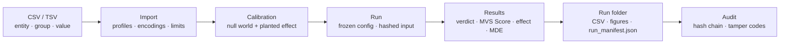
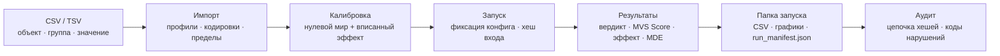

<p align="center">
  
</p>

<h1 align="center" id="mvs-analyzer">MVS Analyzer</h1>

<p align="center">▪</p>

<p align="center"><strong>English</strong> · <a href="#русский">Русский</a></p>

<p align="center">
  Metrics Value System. Which metric actually sees the change you care about?<br>
  Windows desktop · no MVS account · no telemetry · local by default · optional Colab
</p>

<p align="center">
  
  
  
  
  
  
  
  
  
</p>

<p align="center">
  <a href="https://github.com/d1d2dopamine/MVS-Analyzer/releases/latest"></a>
</p>

<p align="center">
  <a href="CHANGELOG.md">Changelog</a> ·
  <a href="docs/METHODS.md">Methods</a> ·
  <a href="docs/REMOTE.md">Remote</a> ·
  <a href="docs/VALIDATION.md">Validation</a> ·
  <a href="docs/ARCHITECTURE.md">Developer docs</a> ·
  <a href="examples/">Example data</a>
</p>

---

> **Current source:** app **1.4.0**, engine **1.6.0**, formula **MVS-1.4.0**. Original badges are retained as artwork; their old version and “network never” labels do not describe optional Colab.

## 🧩 The problem

You measured something — cycle time, optical density, reaction time, yield, error rate — and you have to report *one* number per object. Median? Mean? SD? CV? MAD? IQR?

The usual answer is "whatever the previous paper used". That choice silently decides whether you will see the effect at all, how often you will announce an effect that is not there, and whether the same analysis on a second half of your data would agree with itself.

**MVS Analyzer turns that choice into a measurement.** It replays your own data thousands of times — once in a world where the groups genuinely do not differ, and once in a world where a difference of a known size was planted — and reports, per metric: conditional false-alarm rate and power, with separate robustness, split-half and coverage diagnostics. Then it ranks the metrics and says how much of that ranking the data can actually support.

The intended use is choosing a metric **before** you analyse, or checking that a conclusion does not rest on one lucky metric. Unadjusted metric shopping can inflate false alarms. This version reports raw and full-registry-adjusted p-values; simulation calibration is still conditional on the observed data and chosen scenarios.

> [!NOTE]
> MVS Analyzer does **not** verify a metric against a gold standard, and it does not know your ground truth. It ranks metrics by how well they behave **on your dataset**, and it is loud about the cases where the data cannot decide.

---

## ✨ Highlights

| | |
|---|---|
| **Twelve metrics, one run** | median · mean · SD · CV · MAD · IQR · normalized MAD · normalized IQR · RMS · range · geometric mean · 20% trimmed mean |
| **2–10 independent groups** | Mann–Whitney U / Kruskal–Wallis H; raw and full-registry-adjusted p-values |
| **Two levels of spread** | within-entity variability and between-entity heterogeneity have separate effect scenarios and power estimates |
| **Bootstrap on raw values** | pooled entities and within-entity resampling; uncertainty and failed simulations are reported |
| **A readable verdict** | difference · approximate equivalence · insufficient evidence · not applicable — not a claim of equality |
| **Effect size and MDE** | Cliff's delta; descriptive selected-pair intervals; conditional MDE only when the simulated grid supports it |
| **Additional methods** | Gaussian ML/REML variance components; known-truth bias/MSE/efficiency studies; experimental repeated-measurement MELSM |
| **Frozen method contract** | `MVS-1.4.0`, SHA-256 `10a1e722…0598c` |
| **Inspectable runs** | CSV/JSON, checked calibration state, output manifests and a local integrity journal |
| **Data-only plugins** | import profiles and templates, not executable extensions |
| **Local or Colab** | pure .NET 8 + WinForms, no third-party NuGet dependency; optional cloud execution is explicit |

---

## ⚡ Quick start

### Download the build

[Latest release](https://github.com/d1d2dopamine/MVS-Analyzer/releases/latest) → `MVS_Analyzer_<version>_win-x64.zip`. Unzip, run `MVS_Analyzer.exe`. Windows 10 or later, x64; no .NET installation required. The build is not code-signed, so SmartScreen warns on first run — verify the SHA-256 against `SHA256SUMS.txt` in the release, or follow the developer build guide.

### For developers

Build and CI instructions: [docs/BUILDING.md](docs/BUILDING.md).

### First five minutes

1. Pick a language on first launch (English / Русский — changeable later in **Settings**).
2. **Data → Guided example**, or load [`examples/demo_three_groups.csv`](examples/).
3. **Settings** → scenario, outlier rate, missing rate, effect multiplier, seed.
4. **Calibration** → run locally or choose **Run via Colab**. Then **Run** → analyze.
5. **Results** → read the verdict card, then `results.csv` and `run_manifest.json` in the run folder.
6. **Audit** → point it at the output folder and confirm the run verifies.

Want to see the app catch its own mistakes? Load [`examples/MVS_stress_test.csv`](examples/) — *Control* / *Shift +6 %* / *Noise*. Level metrics and spread metrics point at **different** groups there, and the results card is required to say so instead of calling it agreement.

> **Requirements** — Windows 10/11 x64, .NET 8 SDK (build) or nothing at all (self-contained EXE). Visual Studio 2022 with the *.NET desktop development* workload works out of the box: open `MvsAnalyzer.slnx`, or `MvsAnalyzer.csproj` if your IDE does not read `.slnx` yet.

---

## 🔬 How it works



1. **Data.** One variable, 2–10 independent groups, ≥ 4 entities per group, ≥ 6 valid measurements per entity (configurable). Entity-level metrics are computed once.
2. **Calibration.** For every metric, two worlds are simulated from your own rows:
   - a **null world** — groups are pooled and resampled, so no difference can exist by construction. The share of significant results is the measured **false-alarm rate**.
   - an **effect world** — a constant location shift, within-entity residual multiplier, or between-entity centre-deviation multiplier is applied to the last group. Outlier and missingness mechanisms are applied symmetrically to null and alternative. The share of significant results is **power**.
3. **Run.** The configuration is frozen, the input file is hashed, and the analysis is executed against the real group labels.
4. **Results.** One sentence first — *which* metric, *which* group is higher, *by how much* — then the statistics behind it, then the files.

<details>
<summary><b>What same-data calibration does and does not establish</b></summary>

The null and alternative use the same pooled-entity baseline, with an artificial effect only in the alternative. These are conditional simulations, not independent evidence that the chosen metric generalizes. Every applicable metric remains in the reported registry, with a fixed family correction.

If that is still too close for comfort, switch on **Settings → Scientific rigour → Split calibration**: entities are split in half, the metric is chosen on one half, and the answer is computed on the other. Minimum 8 entities per group. The manifest records which mode was used in `calibration.calibrationSource`.

</details>

---

## 📈 The MVS Score

A 0–100 **detection score**, computed separately for each track. Let $a=\alpha/12$, $P$ be conditional power, and $f$ conditional FPR:

$$\mathrm{MVS}=100\sqrt{P\exp[-\max(0,f-a)/a]}.$$

Robustness, repeatability and coverage are separate diagnostics, not score weights. A higher score is not lower bias or MSE and does not make different estimands interchangeable.

```text
MVS-1.4.0   sha256 = 10a1e72218bd65ec024fc981aab9b9d0a9de8ac00db9188f9d80d54e1170598c
```

**Candidates:** applicable metrics with the Wilson lower power bound ≥ 0.70 and upper FPR bound ≤ `max(1.5*a, a+0.02)`, at most four per track. There is **no score ≥ 60 gate**. The candidate set may be empty. Candidates rank sensitivity; they do not replace the full-registry statistical correction.

[Methods and assumptions](docs/METHODS.md) · [Known-truth estimation studies](docs/METHODS.md)

---

## ⚗️ Verdicts: a run says what it *cannot* say

| Verdict | Meaning |
|---|---|
| **Difference** | the full-registry-adjusted rank test rejects its null |
| **Approximate equivalence** | for two groups, the adjusted-level bootstrap interval lies inside the declared margin; not an exact TOST test |
| **Insufficient evidence** | neither criterion is established; this does not mean equality |
| **Not applicable** | the metric cannot be computed meaningfully for these data |

Cliff's delta uses **first group minus second group**. With more than two groups, the selected extreme pair and its 95% interval are descriptive, not a corrected post-hoc claim. The default practical-equivalence margin is `0.147`; justify it for your question.

**MDE** is conditional on the simulated grid `1.00 / 1.02 / 1.05 / 1.10 / 1.20`, target power 0.80, and at least 100 simulations per grid point. No supported crossing means unavailable, not extrapolation or proof that no effect exists.

---

## 📦 Run outputs

Every run writes a self-contained, hash-verified folder:

| File | Contents |
|---|---|
| `results.csv` | per metric: group summary, raw/adjusted *p*, Cliff's delta + CI, approximate equivalence interval, verdict, MDE, FPR (+ inflation flag), power, robustness, repeatability, coverage, MVS Score, applicable, candidate, near-miss |
| `calibration.csv`, `calibration_tracks.csv` | per metric: FPR, power, full power curve, MDE, robustness, repeatability, coverage, score |
| `data_quality.csv` | per entity: group, valid measurements and all twelve metrics (identifiers pseudonymized by default) |
| `calibration_state.json` | schema-checked, checksummed calibration for replay |
| `results.json` | structured result table; unavailable numbers are JSON `null` |
| `run_manifest.json` | full provenance: app + engine version, formula string & hash, seed, scenario, α, effect grid, equivalence margin, calibration source, plugin set, figure settings, SHA-256 of the **input** file and of every output file |
| `*.png` / `*.svg` | figures: value distribution, MVS ranking, FPR × power map, group comparison, data quality, plus any plugin templates |
| `report_*.txt` | text reports contributed by plugins (written before the manifest, therefore hashed too) |

Numbers are formatted round-trip (`R`) and culture-invariant, so stored numbers are locale-independent. Choose the correct delimiter/decimal convention when importing CSV into a spreadsheet.

---

## 🔐 Reproducibility and audit

- Each run folder is hashed **including the input dataset** — a result can be tied back to the data it claims to describe.
- Every run is appended to `%LocalAppData%\MVS_Analyzer\run_journal.jsonl`, where each line stores the SHA-256 of the previous line. Unmatched edits can break the chain; somebody able to rewrite the entire local journal can rebuild it.
- **Audit** (sidebar, `Ctrl+9`) walks a folder recursively, recomputes every hash and reports:

| Code | What it caught |
|---|---|
| `FILE_MODIFIED` / `FILE_MISSING` | a result was edited or deleted after the run |
| `FORMULA_CHANGED` | the MVS formula differs from the frozen specification |
| `NO_INPUT_HASH` | legacy run without an input hash |
| `ENGINE_DIFFERS` | another engine version produced the numbers |
| `ORPHAN_RESULTS` | `results.csv` without a manifest — nothing to verify against |
| `SETTINGS_VARIED` | seed / effect / scenario changed on the same dataset |
| `CANDIDATE_SET_UNSTABLE` | the same data produced different candidate sets |
| `RUN_HIDDEN` | the journal remembers a run that is no longer in the folder |
| `JOURNAL_BROKEN` | the hash chain does not verify |

> [!IMPORTANT]
> Hashes help check **consistency against a trusted record, not honesty**. A mutable local journal is neither a digital signature nor external preregistration; it cannot prove that unsuccessful runs were never omitted.

---

## 🧪 Benchmark

**Run → Additional methods → Benchmark.** Compare predeclared selection rules on shared simulated data, including metric shopping, Bonferroni and the shipped full-registry MVS decision path. Diagnostic thresholds are fixed in the source; they are not a promise that a run will pass.

Protocol **MVS-BENCH-1.2.0**, SHA-256 `b81be4a1…48de268`. Earlier benchmark snapshots are historical, not validation of this corrected engine.

Each completed run keeps the diagnostic verdict, CSV tables, protocol, manifest and checksums. A threshold failure remains a report, not a successful scientific validation. Synthetic benchmark jobs can also use **Run via Colab**; the desktop does not silently upload real-recording folders.

[Protocol and limitations](docs/BENCHMARK.md) · [Optional real-recording stage](benchmark_data/README.md).

---

## 🛰️ Run via Colab

<a href="https://colab.research.google.com/github/d1d2dopamine/MVS-Analyzer/blob/main/notebooks/MVS_Colab.ipynb"> Run via Colab</a>

The same button is beside **Calibration**, **Run**, and the additional methods — not hidden in Settings. A confirmed, connected MVS notebook is reopened; otherwise Colab opens a fresh copy (Google may ask you to save it). Pair once in the first cell. Completed calibration is verified, retained and not rerun; its button becomes unavailable for those same data, settings and repetition count.

Three cells: **prepare/calibrate → analyze → download ZIP**. The desktop job carries the exact CLI source, data and processing profile. The notebook invokes the installed .NET host explicitly, so a private SDK installation does not depend on apphost runtime discovery.

Local-network permission is controlled by your browser. If automatic pairing or notebook URL discovery is blocked, use the notebook's URL field or manual job upload/result import. MVS does not enumerate unrelated notebooks in your Google account. Cloud resources and session duration are not guaranteed.

Your measurements leave this PC only after you explicitly choose cloud execution. [Colab details and troubleshooting](docs/REMOTE.md).

---

## 🛡️ Privacy by construction

Local calculations require no MVS account and send no telemetry. Colab is optional and requires Google's service/account; uploaded measurements are processed there. The optional desktop connection listens only on loopback, uses a random job token, checks browser origin and transfers only the selected job/results. No Google password or API secret is requested by MVS.

Settings, the local journal and paired-job cache are under `%LocalAppData%\MVS_Analyzer\`. Pseudonymous identifiers are not irreversible anonymization. Do not share job ZIPs or notebook outputs containing sensitive measurements or connection information.

---

## 📄 Data format

CSV or TSV, one variable per run, delimiter auto-detected (`,` `;` tab), BOM-aware UTF‑8 / UTF‑16, with a Windows‑1251 fallback for legacy Cyrillic exports.

| Role | Required | Recognized column names |
|---|---|---|
| `entity` | ✅ | entity, entity_id, device, device_id, machine, asset, item, sample, object, participant, subject, id |
| `value` | ✅ | value, measurement, reading, result, signal, rt, rt_ms, reaction_time, response_time |
| `group` | ✅ | group, condition, class, category, variant, model, arm |
| `sequence` | — | sequence, index, trial, trial_number, measurement_number, timepoint, step |
| `variable` | — | variable, metric, parameter, measurement_name, signal_name |
| `unit` | — | unit, units |

```csv
entity,group,value,sequence,variable,unit
G1_01,Group 1,117.828,1,demo_measurement,unit
G1_01,Group 1,102.150,2,demo_measurement,unit
```

Any other naming (or a semicolon + decimal-comma export from a lab device) is handled by an **import profile** from a plugin — see [`examples/lab_device_ru_win1251.csv`](examples/) and [docs/DATA_FORMAT.md](docs/DATA_FORMAT.md).

---

## 🧱 Plugins (data only)

A `.mvsplugin` file is a ZIP with `plugin.json` at its root, installed into `%LocalAppData%\MVS_Analyzer\plugins`.

```json
{
  "id": "mvs.report.pack",
  "name": "MVS Report Pack",
  "version": "1.0.0",
  "author": "d1d2dopamine",
  "type": "visualization",
  "minAppVersion": "1.1.0",
  "description": "Four declarative report templates. No code."
}
```

A plugin may add figure templates, import profiles, settings profiles, report templates, validation rules and terminology. It may **not** add code: `.dll .exe .bat .cmd .ps1 .vbs .js .hta .com .scr` are rejected at install time, together with path traversal, packages over 2000 files or 64 MB, and `minAppVersion` above the running engine. Every enabled plugin, its SHA-256 and any rejected file are recorded in the run manifest.

Three ready-made packs live in this repository: [`plugin-report-pack-source`](plugin-report-pack-source), [`plugin-lab-pack-source`](plugin-lab-pack-source), [`plugin-stress-pack-source`](plugin-stress-pack-source). Full format reference: [docs/PLUGINS.md](docs/PLUGINS.md).

---

## ⌨️ Keyboard

| | | | |
|---|---|---|---|
| `Ctrl`+`1` Home | `Ctrl`+`2` Project | `Ctrl`+`3` Data | `Ctrl`+`4` Calibration |
| `Ctrl`+`5` Run | `Ctrl`+`6` Results | `Ctrl`+`7` Figures | `Ctrl`+`8` Outputs |
| `Ctrl`+`9` Audit | `Ctrl`+`0` Settings | | |

Window size and state are remembered between launches. Settings apply immediately — there are no *Apply* buttons and no "saved!" pop-ups anywhere in the app.

---

## 🗂️ Repository layout

```text
MVS-Analyzer/
├─ MvsAnalyzer.csproj            Windows desktop entry project
├─ Core/                        metrics, simulation, numerical models and contracts
├─ Infrastructure/              import/export, state, plugins, audit and Colab jobs
├─ Desktop/                     WinForms pages, measured layout, icons and local bridge
├─ Benchmark/                   declared benchmark protocol and reporting
├─ MvsAnalyzer.Cli/             portable .NET 8 command line
├─ MvsAnalyzer.Tests/           desktop-linked regressions
├─ MvsAnalyzer.Core.Tests/      portable numerical and state regressions
├─ MvsAnalyzer.Ui.Tests/        Windows geometry checks and review screenshots
├─ Assets/                      preserved branding, DPI Colab icons, exact CLI source payload
├─ notebooks/                   two Colab notebooks and their readable Python helper
├─ tools/                       source, payload, notebook and offline regression checks
├─ examples/                    example measurement files
├─ validation/                  provenance, reference checks and explicit QA limitations
├─ docs/                        methods and product/developer documentation
└─ plugin-*-source/             data-only sample plugin packs
```

---

## 🚧 Status, limitations, roadmap

- The main metric workflow assumes **independent groups**. Repeated subjects across conditions belong in the optional **experimental MELSM** workflow, not independent rank tests.
- Variance components use a Gaussian random-intercept model. A scenario sensitivity estimate is not a causal or distribution-free guarantee.
- Bias, MSE and relative efficiency require a declared estimand and known truth. They are available in the simulation study, not inferred from an arbitrary uploaded CSV.
- There are no general post-hoc pairwise tests, AR(1), random slopes or arbitrary-covariate MELSM formula language.
- Small calibration budgets are smoke checks. Monte Carlo uncertainty, failures and boundary fits must be read before interpretation.
- The Windows layout harness and live Colab integration still need to pass on the target environments; source checks alone cannot certify the UI. See [package QA](validation/PACKAGE_QA.md).
- The project is **not independently validated for clinical, safety-critical or confirmatory use**.

Next priorities: independent numerical replication, wider Windows/DPI accessibility testing, repeated-design validation and persistent project history. [Validation](docs/VALIDATION.md) · [Changes](CHANGELOG.md).

---

## ❓ FAQ

<details>
<summary><b>Does it need internet, an account, or a licence key?</b></summary>

Local analysis needs no network or MVS account. Optional Colab uses the internet and Google; local results remain verifiable offline.

</details>

<details>
<summary><b>Can the candidate set really be empty?</b></summary>

Yes. Candidates must pass the uncertainty-aware power/FPR gates. An empty set does not hide the other metric results. There is no score-60 threshold.

</details>

<details>
<summary><b>Why do old runs stop matching after an update?</b></summary>

Because the formula version changed. That is what `FORMULA_CHANGED` is for: the audit tells you the numbers came from a different definition, so those runs have to be repeated. Version numbers are only meaningful if they are enforced.

</details>

<details>
<summary><b>Twelve metrics on one dataset — where is the multiplicity correction?</b></summary>

All applicable metrics are reported with a fixed 12-metric Bonferroni correction. Calibration gates and the optional disjoint split do not replace it. Confirmatory use still needs a justified protocol and independent validation.

</details>

<details>
<summary><b>Linux or macOS?</b></summary>

The GUI is Windows-only. The shipped .NET 8 CLI runs headlessly on Linux and powers Colab. macOS is not a tested release target.

</details>

---

## 🤝 Contributing

Bug reports and pull requests are welcome — start with [CONTRIBUTING.md](CONTRIBUTING.md), and read [docs/METHODS.md](docs/METHODS.md) first if the change touches statistics. One rule above all others: **if the score definition changes, the formula version, its hash and `FormulaHash` test must change with it, in the same commit.**

- Bugs and ideas → [Issues](https://github.com/d1d2dopamine/MVS-Analyzer/issues)
- Security and plugin-safety reports → [SECURITY.md](SECURITY.md)
- Behaviour in the community → [CODE_OF_CONDUCT.md](CODE_OF_CONDUCT.md)

---

## 📌 Citation

If MVS Analyzer influenced a published result, cite it with the metadata in [CITATION.cff](CITATION.cff) and include the `formula.hash` and `engineVersion` from your `run_manifest.json` — that pair identifies the method contract; also retain the full manifest, data hash, configuration and execution environment.

---

## ⚖️ License

[MIT](LICENSE) © d1d2dopamine

---

<p align="center">
  
</p>

<h1 align="center" id="русский">MVS Analyzer</h1>

<p align="center">▪</p>

<p align="center"><a href="#mvs-analyzer">English</a> · <strong>Русский</strong></p>

<p align="center">
  Metrics Value System. Какая метрика действительно видит изменение, которое вам важно?<br>
  Настольное приложение для Windows · без аккаунта MVS и телеметрии · локально или по выбору через Colab
</p>

<p align="center">
  
  
  
  
  
  
  
  
  
</p>

<p align="center">
  <a href="https://github.com/d1d2dopamine/MVS-Analyzer/releases/latest"></a>
</p>

<p align="center">
  <a href="CHANGELOG.md">Изменения</a> ·
  <a href="docs/METHODS.md">Методы</a> ·
  <a href="docs/REMOTE.md">Удалённо</a> ·
  <a href="docs/VALIDATION.md">Валидация</a> ·
  <a href="docs/ARCHITECTURE.md">Документация</a> ·
  <a href="examples/">Примеры данных</a>
</p>

---

> **Текущие исходники:** приложение **1.4.0**, ядро **1.6.0**, формула **MVS-1.4.0**. Исходные бейджи сохранены без изменений; старые номера и «network never» не описывают режим Colab.

## 🧩 Зачем это нужно

Вы что-то измерили — время цикла, оптическую плотность, время реакции, выход годного, долю ошибок — и должны отчитаться *одним* числом на объект. Медиана? Среднее? SD? CV? MAD? IQR?

Обычно ответ звучит как «так делали в прошлой статье». Но именно этот выбор решает, увидите ли вы эффект вообще, как часто вы объявите эффект, которого нет, и совпадёт ли анализ сам с собой на второй половине данных.

**MVS Analyzer превращает этот выбор в измерение.** Он тысячи раз переигрывает ваши же данные — в мире, где разницы между группами точно нет, и в мире, где разница известного размера вписана искусственно, — и для каждой метрики измеряет: условные частоту ложных тревог и мощность; отдельно — диагностики устойчивости, повторяемости и покрытия. Затем он ранжирует метрики и говорит, насколько этот порядок вообще подкреплён данными.

Программа рассчитана на то, что метрику выбирают **до** анализа — либо на проверку того, что вывод не держится на одной удачной метрике. Перебор метрик без поправки завышает ложные тревоги. В этой версии показаны исходные p-value и поправка по всему реестру; симуляционная калибровка всё равно условна относительно данных и выбранных сценариев.

> [!NOTE]
> Программа **не** сверяет метрику с эталоном и не знает истины. Она ранжирует метрики по тому, как они ведут себя **на вашем датасете**, и громко сообщает, когда данных не хватает для вывода.

---

## ✨ Коротко о главном

| | |
|---|---|
| **12 метрик за запуск** | median · mean · SD · CV · MAD · IQR · normalized MAD · normalized IQR · RMS · range · geometric mean · 20% trimmed mean |
| **2–10 независимых групп** | Mann–Whitney / Kruskal–Wallis; исходные p-value и поправка по полному реестру |
| **Два уровня разброса** | внутрисущностная вариативность и межсущностная гетерогенность: раздельные сценарии и мощность |
| **Bootstrap исходных значений** | перевыборка объектов и измерений; интервалы неопределённости и учёт неудачных симуляций |
| **Понятный вердикт** | различие · приближённая эквивалентность · недостаточно свидетельств · неприменима — без обещаний равенства |
| **Эффект и MDE** | дельта Клиффа; выбранная пара описательна; MDE только при достаточной поддержке сеткой симуляций |
| **Дополнительные методы** | ML/REML-компоненты дисперсии, bias/MSE/эффективность при известной истине, экспериментальный MELSM для повторных измерений |
| **Фиксированное определение** | `MVS-1.4.0`, SHA-256 `10a1e722…0598c` |
| **Проверяемые файлы** | CSV/JSON, сохранённая калибровка, манифесты и локальный журнал целостности |
| **Плагины без кода** | профили импорта и шаблоны, не исполняемые расширения |
| **Локально или через Colab** | .NET 8 + WinForms без сторонних NuGet; облачная обработка включается явно |

---

## ⚡ Быстрый старт

### Скачать сборку

[Последний релиз](https://github.com/d1d2dopamine/MVS-Analyzer/releases/latest) → `MVS_Analyzer_<версия>_win-x64.zip`. Распакуйте и запустите `MVS_Analyzer.exe`. Нужна Windows 10+ x64, устанавливать .NET не требуется. Сборка не подписана, поэтому при первом запуске SmartScreen покажет предупреждение — сверьте SHA-256 архива с `SHA256SUMS.txt` из релиза или соберите сами.

### Разработчикам

Сборка и CI вынесены в [docs/BUILDING.md](docs/BUILDING.md).

### Первые пять минут

1. На первом запуске выберите язык (меняется потом в «Настройках»).
2. «Данные» → «Пример», либо загрузите [`examples/demo_three_groups.csv`](examples/).
3. «Настройки» → сценарий, выбросы, пропуски, множитель эффекта, seed.
4. «Калибровка» → локальный запуск или **«Запустить через Colab»**. Затем «Запуск» → анализ.
5. «Результаты» → карточка вердикта, затем `results.csv` и `run_manifest.json`.
6. «Аудит» → укажите папку вывода и убедитесь, что прогон проверяется.

Хотите увидеть, как программа ловит сама себя? Загрузите [`examples/MVS_stress_test.csv`](examples/) — *Control / Shift +6 % / Noise*. Метрики уровня и метрики разброса там указывают на **разные** группы, и карточка результатов обязана это сказать, а не называть согласием.

---

## 🔬 Как это работает



1. **Данные.** Одна переменная, 2–10 независимых групп, ≥ 4 объектов в группе, ≥ 6 годных измерений на объект (настраивается).
2. **Калибровка.** Для каждой метрики строятся два мира из ваших же строк:
   - **нулевой** — группы объединяются и перевыбираются, разницы там нет по построению. Доля значимых результатов — измеренная **частота ложных тревог**;
   - **мир с эффектом** — к последней группе применяется сдвиг уровня, множитель внутрисущностных остатков или отклонений центров объектов. Выбросы и пропуски задаются симметрично в нулевом и альтернативном сценариях. Доля значимых результатов — **мощность**.
3. **Запуск.** Конфигурация фиксируется, входной файл хешируется, расчёт идёт по настоящим меткам групп.
4. **Результаты.** Сначала одно предложение — какая метрика, какая группа выше и на сколько процентов, — потом статистика, потом файлы.

<details>
<summary><b>Что означает калибровка на собственных данных</b></summary>

Нулевой и альтернативный сценарии используют общую объединённую базу объектов; искусственный эффект добавляется только в альтернативе. Это условная симуляция, а не независимая проверка обобщаемости. Выводы показаны по полному набору применимых метрик с фиксированной поправкой.

Если этого мало — включите «Настройки → Научная строгость → Раздельная калибровка»: объекты делятся пополам, метрика выбирается на одной половине, ответ считается на другой. Минимум 8 объектов в группе. Режим записывается в манифест (`calibration.calibrationSource`).

</details>

---

## 📈 MVS Score

Число 0–100 — **балл обнаружения**, отдельно по каждому сценарию. При $a=\alpha/12$, условной мощности $P$ и частоте ложных тревог $f$:

$$\mathrm{MVS}=100\sqrt{P\exp[-\max(0,f-a)/a]}.$$

Устойчивость, повторяемость и покрытие — отдельные диагностики, а не веса балла. Высокий score не означает меньшие bias/MSE и не делает разные оцениваемые величины взаимозаменяемыми.

```text
MVS-1.4.0   sha256 = 10a1e72218bd65ec024fc981aab9b9d0a9de8ac00db9188f9d80d54e1170598c
```

**Кандидаты:** применимые метрики с нижней границей мощности Wilson ≥ 0.70 и верхней границей FPR ≤ `max(1.5*a, a+0.02)`; не более четырёх на сценарий. **Порог score ≥ 60 удалён.** Набор кандидатов может быть пустым. Ранжирование чувствительности не заменяет поправку по полному реестру.

[Определения и допущения](docs/METHODS.md). Для bias/MSE есть отдельное исследование с известной истиной.

---

## ⚗️ Вердикты

| Вердикт | Смысл |
|---|---|
| **Есть различие** | ранговый тест отклоняет нулевую гипотезу с поправкой по полному реестру |
| **Приближённая эквивалентность** | для двух групп интервал скорректированного уровня внутри заданной границы; это не точный TOST |
| **Недостаточно свидетельств** | ни один критерий не установлен; это не равенство |
| **Неприменима** | метрика не имеет содержательного значения на этих данных |

Знак дельты Клиффа: **первая группа минус вторая**. При числе групп больше двух выбранная крайняя пара и её 95%-й интервал описательны, а не отдельный post-hoc вывод с поправкой. Граница практической эквивалентности по умолчанию `0.147` требует обоснования для вашей задачи.

**MDE** условен относительно сетки `1.00 / 1.02 / 1.05 / 1.10 / 1.20`, целевой мощности 0.80 и бюджета не менее 100 симуляций на точку. Если пересечение не подтверждено — значение недоступно, а не экстраполировано.

---

## 📦 Файлы запуска

| Файл | Содержимое |
|---|---|
| `results.csv` | по метрикам: сводка по группам, исходный/скорректированный *p*, дельта Клиффа с ДИ, приближённый интервал эквивалентности, вердикт, MDE, FPR (и флаг завышения), мощность, устойчивость, повторяемость, покрытие, MVS Score, применимость, кандидат, почти-кандидат |
| `calibration.csv`, `calibration_tracks.csv` | FPR, мощность, кривая мощности, MDE, устойчивость, повторяемость, покрытие, score |
| `data_quality.csv` | по объектам: группа, число измерений и все двенадцать метрик (идентификаторы псевдонимизированы) |
| `calibration_state.json` | проверяемая калибровка для повторного использования |
| `results.json` | структурированная таблица; недоступные числа записаны как JSON `null` |
| `run_manifest.json` | полная провенанс-запись: версии, формула и её хеш, seed, сценарий, α, сетка эффектов, граница эквивалентности, источник калибровки, плагины, настройки графиков, SHA-256 входного файла и каждого выходного |
| `*.png` / `*.svg` | графики: распределение значений, ранжирование MVS, карта FPR × мощность, сравнение групп, качество данных и шаблоны плагинов |
| `report_*.txt` | текстовые отчёты плагинов (пишутся до манифеста, поэтому тоже хешируются) |

Числа записываются в формате `R` и без культурных разделителей: `0.0477` остаётся `0.0477` в любой локали, при импорте CSV в таблицы нужно выбрать соответствующие разделитель и десятичный формат.

---

## 🔐 Воспроизводимость и аудит

- Папка запуска хешируется **вместе с входным датасетом** — результат привязан к данным, которые он описывает.
- Каждый прогон дописывается в `%LocalAppData%\MVS_Analyzer\run_journal.jsonl`, где каждая строка хранит SHA-256 предыдущей. Несогласованные изменения обнаруживаются, но человек с доступом ко всему журналу может переписать его и пересчитать цепочку.
- Раздел **«Аудит»** (`Ctrl+9`) рекурсивно проверяет папку и выдаёт коды: `FILE_MODIFIED`, `FILE_MISSING`, `FORMULA_CHANGED`, `NO_INPUT_HASH`, `ENGINE_DIFFERS`, `ORPHAN_RESULTS`, `SETTINGS_VARIED`, `CANDIDATE_SET_UNSTABLE`, `RUN_HIDDEN`, `JOURNAL_BROKEN`.

> [!IMPORTANT]
> Хеши помогают сверить **целостность с доверенной записью, не честность**. Изменяемый локальный журнал — не цифровая подпись и не внешняя пререгистрация; он не доказывает, что неудачные прогоны никогда не скрывали.

---

## 🧪 Бенчмарк

**«Запуск» → «Дополнительные методы» → «Бенчмарк».** Сравнение заранее заданных правил на общих симуляциях: перебор метрик, Bonferroni и фактический путь решений MVS по полному реестру. Пороги фиксированы в исходниках, но не обещают успешного прохождения.

Протокол **MVS-BENCH-1.2.0**, SHA-256 `b81be4a1…48de268`. Старые отчёты — история, не валидация исправленного ядра.

Сохраняются диагностический вердикт, таблицы, протокол, манифест и контрольные суммы. Непройденный порог остаётся результатом, а не успешной научной проверкой. Для синтетического бенчмарка есть **«Запустить через Colab»**; папки реальных записей не отправляются молча.

[Протокол и ограничения](docs/BENCHMARK.md) · [Стадия на реальных записях](benchmark_data/README.md).

---

## 🛰️ Запустить через Colab

<a href="https://colab.research.google.com/github/d1d2dopamine/MVS-Analyzer/blob/main/notebooks/MVS_Colab.ipynb"> Запустить через Colab</a>

Одинаковая кнопка находится рядом с **калибровкой**, **запуском** и дополнительными методами, а не в «Настройках». Подтверждённый подключённый ноутбук MVS открывается повторно; иначе Colab открывает новую копию (Google может попросить её сохранить). Один раз подключите первую ячейку. Проверенная готовая калибровка сохраняется и не повторяется; для тех же данных, настроек и числа симуляций кнопка становится недоступной.

Три ячейки: **подготовка/калибровка → анализ → скачать ZIP**. Задание переносит точные исходники CLI, данные и профиль обработки. Запуск через установленный .NET host больше не зависит от поиска runtime отдельным apphost.

Разрешение локального подключения зависит от браузера. Если автоматическая связь или определение адреса недоступны, используйте поле URL в ноутбуке либо ручной обмен ZIP. MVS не просматривает все ноутбуки Google-аккаунта. Длительность сессии и доступные мощности не гарантированы.

Измерения покидают ПК только после явного выбора облачного расчёта. [Подробнее о Colab](docs/REMOTE.md).

---

## 🛡️ Приватность по построению

Для локальных расчётов не нужны аккаунт MVS и телеметрия. Colab — отдельный добровольный режим с сервисом/аккаунтом Google; загруженные измерения обрабатываются там. Необязательное подключение приложения слушает только этот компьютер, проверяет источник браузерного запроса и случайный код задания. Пароли и API-секреты Google у пользователя не запрашиваются.

Настройки, журнал и кеш связанных заданий находятся в `%LocalAppData%\MVS_Analyzer\`. Псевдонимизация не равна необратимой анонимизации. Не публикуйте архивы заданий или вывод ноутбука с чувствительными данными и сведениями подключения.

---

## 📄 Формат данных

CSV или TSV, одна переменная за запуск, разделитель определяется автоматически (`,` `;` табуляция), поддержаны BOM UTF‑8 / UTF‑16 и откат на Windows‑1251.

| Роль | Обязательна | Распознаваемые имена колонок |
|---|---|---|
| `entity` | ✅ | entity, entity_id, device, machine, asset, item, sample, object, participant, subject, id |
| `value` | ✅ | value, measurement, reading, result, signal, rt, rt_ms, reaction_time, response_time |
| `group` | ✅ | group, condition, class, category, variant, model, arm |
| `sequence` | — | sequence, index, trial, trial_number, measurement_number, timepoint, step |
| `variable` | — | variable, metric, parameter, measurement_name, signal_name |
| `unit` | — | unit, units |

Любые другие имена (или экспорт лабораторного прибора с `;` и десятичной запятой) решаются **профилем импорта** из плагина — см. [`examples/lab_device_ru_win1251.csv`](examples/) и [docs/DATA_FORMAT.md](docs/DATA_FORMAT.md).

---

## 🧱 Плагины (только данные)

Файл `.mvsplugin` — это ZIP с `plugin.json` в корне, устанавливается в `%LocalAppData%\MVS_Analyzer\plugins`. Плагин может добавлять шаблоны графиков, профили импорта и настроек, шаблоны отчётов, правила проверки и словари терминов. Код запрещён: `.dll .exe .bat .cmd .ps1 .vbs .js .hta .com .scr` отклоняются при установке, как и выход за пределы папки, пакеты больше 2000 файлов или 64 МБ и слишком высокий `minAppVersion`.

В репозитории есть три готовых пакета: [`plugin-report-pack-source`](plugin-report-pack-source), [`plugin-lab-pack-source`](plugin-lab-pack-source), [`plugin-stress-pack-source`](plugin-stress-pack-source). Справочник: [docs/PLUGINS.md](docs/PLUGINS.md).

---

## ⌨️ Горячие клавиши

| | | | |
|---|---|---|---|
| `Ctrl`+`1` Главная | `Ctrl`+`2` Проект | `Ctrl`+`3` Данные | `Ctrl`+`4` Калибровка |
| `Ctrl`+`5` Запуск | `Ctrl`+`6` Результаты | `Ctrl`+`7` Графики | `Ctrl`+`8` Файлы |
| `Ctrl`+`9` Аудит | `Ctrl`+`0` Настройки | | |

Размер окна запоминается между запусками. Настройки применяются сразу — кнопок «Применить» и окон «Сохранено» в программе нет.

---

## 🗂️ Структура репозитория

```text
MVS-Analyzer/
├─ MvsAnalyzer.csproj            Windows desktop entry project
├─ Core/                        metrics, simulation, numerical models and contracts
├─ Infrastructure/              import/export, state, plugins, audit and Colab jobs
├─ Desktop/                     WinForms pages, measured layout, icons and local bridge
├─ Benchmark/                   declared benchmark protocol and reporting
├─ MvsAnalyzer.Cli/             portable .NET 8 command line
├─ MvsAnalyzer.Tests/           desktop-linked regressions
├─ MvsAnalyzer.Core.Tests/      portable numerical and state regressions
├─ MvsAnalyzer.Ui.Tests/        Windows geometry checks and review screenshots
├─ Assets/                      preserved branding, DPI Colab icons, exact CLI source payload
├─ notebooks/                   two Colab notebooks and their readable Python helper
├─ tools/                       source, payload, notebook and offline regression checks
├─ examples/                    example measurement files
├─ validation/                  provenance, reference checks and explicit QA limitations
├─ docs/                        methods and product/developer documentation
└─ plugin-*-source/             data-only sample plugin packs
```

Исходники разделены по назначению; `SharedSources.props` задаёт общий набор переносимых файлов для CLI и тестов.

---

## 🚧 Ограничения и планы

- Основной сценарий метрик предполагает **независимые группы**. Одни и те же люди/объекты в разных условиях — задача необязательного **экспериментального MELSM**, не независимых ранговых тестов.
- Компоненты дисперсии используют гауссовскую модель случайного интерсепта. Чувствительность к сценарию — не причинная и не безусловная гарантия.
- Bias, MSE и относительная эффективность требуют заданной оцениваемой величины и известной истины. Они рассчитываются в симуляционном исследовании, а не угадываются по произвольному CSV.
- Нет универсальных post-hoc тестов, AR(1), случайных наклонов и языка произвольных ковариат MELSM.
- Малые бюджеты калибровки — техническая проверка. Нужно читать неопределённость Монте-Карло, число неудач и пограничные решения.
- Windows-проверки вёрстки и живое подключение Colab должны пройти в целевых средах; статический анализ не подтверждает качество UI. См. [QA архива](validation/PACKAGE_QA.md).
- Программа **не прошла независимую валидацию для клинических, критичных по безопасности или подтверждающих решений**.

Приоритеты: независимая численная перепроверка, Windows/DPI и доступность, валидация повторных дизайнов, постоянная история проектов. [Валидация](docs/VALIDATION.md) · [Изменения](CHANGELOG.md).

---

## ❓ Вопросы и ответы

<details>
<summary><b>Нужен ли интернет, аккаунт или ключ?</b></summary>

Для локального анализа — нет. Необязательный Colab требует интернета и Google; локальные результаты по-прежнему можно проверять офлайн.

</details>

<details>
<summary><b>Набор кандидатов действительно может быть пустым?</b></summary>

Да. Кандидат должен пройти пороги мощности и FPR с учётом неопределённости. Пустой набор не скрывает остальные результаты.

</details>

<details>
<summary><b>Почему после обновления старые прогоны перестают сходиться?</b></summary>

Потому что изменилась версия формулы. Именно для этого есть `FORMULA_CHANGED`: аудит сообщает, что числа получены по другому определению, и такие прогоны надо повторить. Номера версий имеют смысл только тогда, когда их кто-то проверяет.

</details>

<details>
<summary><b>Двенадцать метрик на одних данных — где поправка на множественность?</b></summary>

Для всех применимых метрик показана фиксированная поправка Bonferroni по 12 метрикам. Пороги калибровки и раздельная выборка не заменяют поправку. Подтверждающее применение требует обоснованного протокола и независимой валидации.

</details>

<details>
<summary><b>Linux или macOS?</b></summary>

Оконный интерфейс — только Windows. Переносимый CLI .NET 8 уже работает без окна на Linux и используется в Colab. macOS не является проверенной целью релиза.

</details>

---

## 🤝 Участие в разработке

Ошибки и pull request’ы приветствуются — начните с [CONTRIBUTING.md](CONTRIBUTING.md). Главное правило: **если меняется определение балла, в том же коммите меняются версия формулы, её хеш и тест `FormulaHash`.**

- Ошибки и идеи → [Issues](https://github.com/d1d2dopamine/MVS-Analyzer/issues)
- Безопасность и проблемы с плагинами → [SECURITY.md](SECURITY.md)
- Правила общения → [CODE_OF_CONDUCT.md](CODE_OF_CONDUCT.md)

Документация в `docs/` ведётся на английском.

---

## 📌 Цитирование

Если MVS Analyzer повлиял на опубликованный результат, сошлитесь на метаданные из [CITATION.cff](CITATION.cff) и укажите `formula.hash` и `engineVersion` из своего `run_manifest.json` — эта пара определяет контракт метода; также сохраняйте полный манифест, хеш данных, настройки и среду выполнения.

---

## ⚖️ Лицензия

[MIT](LICENSE) © d1d2dopamine

---

<p align="center">
  <sub>Сделано для тех, кто сначала измеряет свой инструмент, а потом — мир.<br>
  <a href="#mvs-analyzer">↑ Наверх / Back to top</a></sub>
</p>
