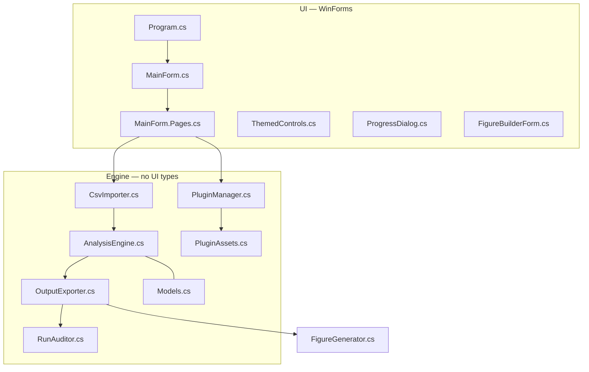

# Architecture

A single WinForms executable, no NuGet packages, no network, no plugin code loading. Everything below is in the repository root unless noted.



---

## The one architectural rule

**Engine code never references WinForms.** `AnalysisEngine`, `OutputExporter`, `RunAuditor`, `CsvImporter`, `PluginManager`, `PluginAssets` and `Models` are plain .NET. The UI calls into them; they never call back.

That boundary is what makes three things possible: unit tests without a message loop, a future headless CLI, and reasoning about the statistics without reading form code. Please do not cross it.

---

## Files

| File | Size | Responsibility |
|---|---:|---|
| `Program.cs` | small | entry point, first-run language dialog, global exception guard |
| `MainForm.cs` | ~35 KB | shell: theme, sidebar, card layout, grids, hotkeys, window state |
| `MainForm.Pages.cs` | ~85 KB | the thirteen sections: home, project, data, calibration, run, results, figures, outputs, history, audit, plugins, settings, help |
| `AnalysisEngine.cs` | ~34 KB | metrics, Mann–Whitney, Kruskal–Wallis, calibration, Cliff's delta, bootstrap, TOST, MDE, scores |
| `OutputExporter.cs` | ~11 KB | frozen formula string and hash, CSV writers, `run_manifest.json` |
| `RunAuditor.cs` | ~14 KB | run journal (hash chain), recursive folder audit, audit codes |
| `CsvImporter.cs` | ~12 KB | delimiter/encoding detection, role mapping, decimal comma, filtering |
| `FigureGenerator.cs` | ~41 KB | figure rendering with `System.Drawing` |
| `PluginManager.cs` | ~13 KB | install, validate, hash, enable/disable plugin packages |
| `PluginAssets.cs` | ~15 KB | import profiles, settings profiles, report templates, validation rules, terms |
| `ThemedControls.cs` | ~10 KB | light/dark/system theming primitives |
| `ProgressDialog.cs` | small | cancellable progress for long calibrations |
| `FigureBuilderForm.cs` | ~12 KB | interactive figure template builder |
| `Models.cs` | ~9 KB | data records shared between engine and UI |
| `Properties/AssemblyInfo.cs` | small | `InternalsVisibleTo("MvsAnalyzer.Tests")` |
| `MvsAnalyzer.Tests/` | — | dependency-free console harness, 12 checks |

---

## Data flow of one run

1. **`CsvImporter`** → rows with roles resolved, invalid values filtered, exclusions counted.
2. **`AnalysisEngine.Build*`** → entity-level metrics; groups validated (2–10, ≥ 4 entities each).
3. **`AnalysisEngine.Calibrate`** → null world and effect world per metric → FPR, power, power curve, robustness, repeatability, coverage, MDE.
4. **`AnalysisEngine.Analyze`** → real test on real labels → global *p*, Cliff's delta + bootstrap interval, TOST, verdict.
5. **Score and candidates** → MVS Score per metric, candidate rules, near misses.
6. **`FigureGenerator`** → default and plugin templates.
7. **Plugin reports** → `report_*.txt` (before the manifest, so they are hashed).
8. **`OutputExporter`** → `results.csv`, `calibration.csv`, `data_quality.csv`, then `run_manifest.json` with all file hashes.
9. **`RunAuditor`** → append to the hash-chained journal.

The order of steps 7–8 is a correctness requirement, not a style choice — reversing it was the 1.3.1 bug.

---

## State on disk

```text
%LocalAppData%\MVS_Analyzer\
├─ settings.txt          key=value, applied immediately, no Apply button
├─ language.txt          en | ru
├─ window.txt            size, position, maximized state
├─ run_journal.jsonl     append-only, SHA-256 chained
└─ plugins\<id>\         unpacked package + package.sha256 [+ disabled.flag]
```

Nothing is written anywhere else, and nothing leaves the machine.

---

## UI model

- **Thirteen sections** in a sidebar; `Ctrl`+`1`…`Ctrl`+`0` map to the ten most used.
- **Two modes:** *guided* (explanations inline, safer defaults) and *expert* (dense, everything exposed). Set per user, remembered.
- **Themes:** system, light, dark — applied through `ThemedControls`, no per-form colour literals.
- **Localization:** English and Russian, chosen on first launch, switchable in Settings. Both languages are required for every user-visible string.
- **No modal noise:** settings apply immediately; there are no *Apply* buttons and no "Saved!" dialogs anywhere in the app.

**Known weakness:** layout inside cards still uses absolute coordinates, so at 125–150 % display scaling elements can shift. Migrating cards to `TableLayoutPanel` is the highest-value UI contribution available.

---

## Tests

`MvsAnalyzer.Tests` is a console project, not a test framework — zero dependencies, run with `dotnet run --project MvsAnalyzer.Tests`, prints `12/12` on success and a non-zero exit code on failure. The app grants it access through `InternalsVisibleTo`.

| Check | Guards |
|---|---|
| `ProcessingLimits` | filtering thresholds behave as documented |
| `MultiGroupBuild` | 2–10 groups build correctly |
| `MannWhitneySymmetry` | swapping groups mirrors the result |
| `KruskalWallisSeparation` | separated groups are detected |
| `CandidateThresholds` | candidate rules and the cap of four |
| `UniqueRunFolders` | runs never overwrite each other |
| `FormulaHash` | the frozen specification and its SHA-256 match |
| `DeltaSymmetry` | Cliff's delta is antisymmetric |
| `EquivalenceVerdict` | TOST produces *equivalent* when it should |
| `InsufficientVerdict` | wide intervals produce *insufficient*, not *difference* |
| `MdeCurve` | interpolation at power 0.80 |
| `SplitHalves` | repeatability splitting is stable |

---

## Build

```powershell
dotnet build MvsAnalyzer.csproj -c Release
.\build_release.bat    # self-contained single-file win-x64 publish
```

`build_release.bat` runs `dotnet publish -c Release -r win-x64 --self-contained true -p:PublishSingleFile=true -p:DebugType=None -p:DebugSymbols=false` and drops `MVS_Analyzer.exe` in `bin\Release\net8.0-windows\win-x64\publish`.

Target `net8.0-windows`, `AssemblyName` `MVS_Analyzer`, `RootNamespace` `MvsAnalyzer`, nullable enabled, `app.ico` as the application icon, `app.manifest` for DPI awareness and the requested execution level.
